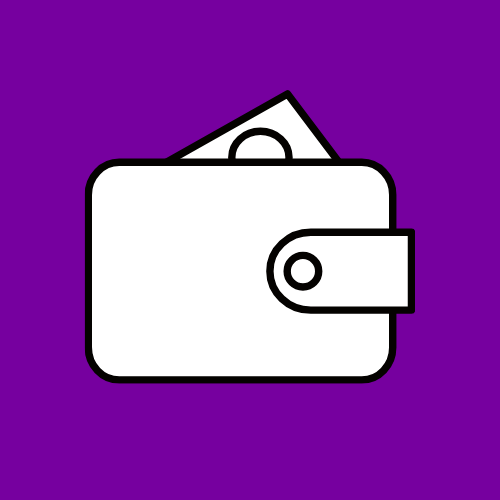

# MoneyHandler

<p align="center">
  
</p>

<p align="center">
  <b>Personal Finance Management App</b><br>
  Track your income, expenses, and accounts with ease
</p>

---

## Why I Built This

Most finance apps out there are either too complex or packed with features I don't need. I just wanted something simple: see my accounts, track how much I spend, and know about upcoming payments. So I built this app with Python to fit my own needs.

It works completely offline. Your data stays on your computer. No cloud, no sign-up, no ads.

## Features

### Account Management
Add different account types like bank accounts, cash, or credit cards. Track each account's balance separately and see your total assets at a glance.

### Income and Expense Tracking
Record every transaction with category, description, and date. Use filters to see how much you spent on each category. Sort your transactions by date, amount, or category.

### Weekly View
View your weekly spending from Monday to Sunday in a calendar format. Each day shows income and expenses separately. Summary cards at the top display daily average spending and weekly totals. Use the category filter to include or exclude specific categories from average calculations.

### Planned Transactions
Schedule recurring income and expenses like rent, bills, or salary. Upcoming payments automatically appear on the Dashboard.

### Regular Income Tracking
Define your recurring monthly income sources like salary, scholarship, or allowance. Set the expected payment day for each income. When you receive payment, record it with the actual date. The app calculates delay statistics showing if payments arrive early, on time, or late. Color-coded indicators help you quickly spot patterns in your income timing.

### Multi-Currency Support
Supports TRY, USD, and EUR currencies. Use the currency selector on Dashboard and Weekly view to display amounts in your preferred currency. Conversion happens automatically.

### Multi-Language Support
Available in Turkish and English. Change the language anytime from the Settings tab. Your preference is saved automatically and persists across app restarts.

## Installation

### Development
```bash
git clone https://github.com/bilalyazicioglu/moneyhandler.git
cd moneyhandler
python3 -m venv venv
source venv/bin/activate
pip install -r requirements.txt
python main.py
```

### Build as Standalone App
```bash
pip install pyinstaller
pyinstaller build.spec --clean --noconfirm
```
Output: `dist/MoneyHandler.app` (macOS) or `dist/MoneyHandler.exe` (Windows)

### Quick Deploy (macOS)
Build and install to Applications folder with a single command:
```bash
./deploy.sh
```
Your data is stored in `~/.moneyhandler/` and persists across app updates.

## Tech Stack

| Technology | Purpose |
|------------|---------|
| Python 3 | Core language |
| PyQt6 | Desktop GUI |
| SQLite | Local database |
| PyInstaller | Standalone builds |

## Project Structure

```
moneyhandler/
├── main.py              # App entry point
├── config.py            # Settings, colors, currencies
├── assets/              # Logo and icons
├── controllers/         # Business logic
├── models/              # Database models
├── views/               # PyQt6 UI components
├── data/                # Database connection
└── build.spec           # PyInstaller config
```

## License

MIT License - See [LICENSE](LICENSE) for details.
